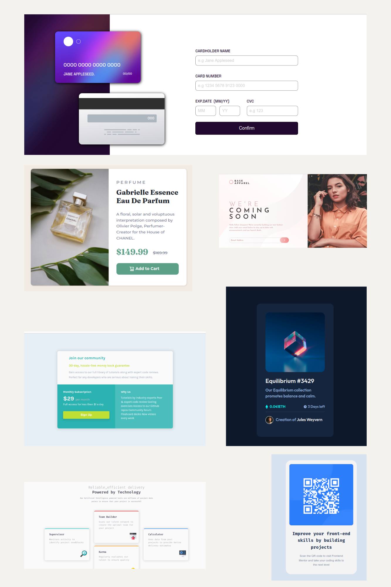

# Página Inicial de Desafios Front-End

Bem-vindo à Página Inicial de Desafios Front-End, onde você pode explorar e acessar nove desafios empolgantes para aprimorar suas habilidades em desenvolvimento web.

## Desafios

1. **Desafio 01:**
   - [Link](https://lucieudo-roberto.github.io/frontend-challenges/desafio_01)
   - Descrição do Desafio 01.

2. **Desafio 02:**
   - [Link](https://lucieudo-roberto.github.io/frontend-challenges/desafio_02)
   - Descrição do Desafio 02.

3. **Desafio 03:**
   - [Link](https://lucieudo-roberto.github.io/frontend-challenges/desafio_03)
   - Descrição do Desafio 03.

4. **Desafio 04:**
   - [Link](https://lucieudo-roberto.github.io/frontend-challenges/desafio_04)
   - Descrição do Desafio 04.

5. **Desafio 05:**
   - [Link](https://lucieudo-roberto.github.io/frontend-challenges/desafio_05)
   - Descrição do Desafio 05.

6. **Desafio 06:**
   - [Link](https://lucieudo-roberto.github.io/frontend-challenges/desafio_06)
   - Descrição do Desafio 06.

7. **Desafio 07:**
   - [Link](https://lucieudo-roberto.github.io/frontend-challenges/desafio_07)
   - Descrição do Desafio 07.

8. **Desafio 08:**
   - [Link](https://lucieudo-roberto.github.io/frontend-challenges/desafio_08)
   - Descrição do Desafio 08.

9. **Desafio 09:**
   - [Link](https://lucieudo-roberto.github.io/frontend-challenges/desafio_09)
   - Descrição do Desafio 09.

10. **Desafio 10:**
   - [Link](https://lucieudo-roberto.github.io/frontend-challenges/desafio_10)
   - Descrição do Desafio 10.

11. **Desafio 11:**
   - [Link](https://lucieudo-roberto.github.io/frontend-challenges/desafio_11)
   - Descrição do Desafio 11.

12. **Desafio 12:**
   - [Link](https://lucieudo-roberto.github.io/frontend-challenges/desafio_12)
   - Descrição do Desafio 12.
